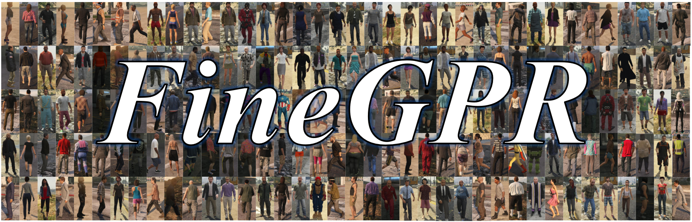

# Less is More: Learning from Synthetic Data with Fine-grained Attributes for Person Re-Identification

The FineGPR dataset is generated by a popular GTA5 game engine that can synthesise images under controllable viewpoints,
weathers,illuminations and backgrounds. <br> <br>

Our FineGPR dataset provides fine-grained and accurately configurable annotations, including 36 different viewpoints,
7 different kinds of weathers, 7 different kinds of illuminations, and 9 different kinds of backgrounds.



</div> 

## Table of Contents
- [Comparison with existing datasets](#Comparision-with-existing-datasets)
- [Link of the Dataset](#Link-of-the-Dataset)
- [Citation](#Citation)


****
## Comparison with existing datasets 
### Some Mainstream Datasets for Person Re-Identification
For FineGPR (for details of the pervious related work, please refer to the [GPR Homepage](https://JeremyXSC.github.io/GPR/)) :

<center>

| dataset      | IDs     | boxs | cams | weathers | illumination | scene | resolution |
|--------------|---------|------|------|----------|--------------|--------------|--------------|
| [Market-1501](https://ieeexplore.ieee.org/stamp/stamp.jsp?tp=&arnumber=7410490) | 1,501 |   32,668   |   6   |   -   |   -   |   -   |  low  |
| [CUHK03](https://ieeexplore.ieee.org/stamp/stamp.jsp?tp=&arnumber=6909421) | 1,467 |   14,096   |   2   |   -   |   -   |   -   |  low  |
| [DukeMTMC-reID](https://arxiv.org/pdf/1701.07717.pdf) | 1,404 |   36,411   |   8   |   -   |   -   |   -   |  low   
| [MSMT17](https://openaccess.thecvf.com/content_cvpr_2018/papers/Wei_Person_Transfer_GAN_CVPR_2018_paper.pdf) | 4,101 |   126,441   |   15   |   -   |   -   |   -   |  vary  |  
|--------------|---------|------|------|----------|--------------|--------------|--------------|
| [SOMAset](https://arxiv.org/pdf/1701.03153.pdf) | 50 |   100,000   |   250   |   -   |   -   |   -   |  -  |
| [SyRI](https://arxiv.org/pdf/1804.10094.pdf) | 100 |   1,680,000   |   100   |   -   |   140   |   -   |  -  |
| [PersonX](https://arxiv.org/pdf/1812.02162.pdf) | 1,266 |   273,456   |   36   |   -   |   -   |   6   |  vary  | 
| [Unreal](https://openaccess.thecvf.com/content/CVPR2021/papers/Zhang_UnrealPerson_An_Adaptive_Pipeline_Towards_Costless_Person_Re-Identification_CVPR_2021_paper.pdf) | 3,000 |   120,000   |   34   |   -   |   -   |   1   |  low  | 
| [RandPerson](https://arxiv.org/abs/2006.12774) | 8,000 |   1,801,816   |   19   |   -   |   6   |   11   |  low  | 
| [FineGPR]() |   1150   |   2,028,600   |   36   |   7   |   7   |   9   |  high  | 
</center>


## Link of the Dataset
### Data of FineGPR for Viewpoint Analysis
A small subset of FineGPR can be downloaded from the following links:<br>
* Baidu Yun Drive: 
	* Coming soon [link]()
* Google Drive: 
	* Coming soon [link]()


Directories & Files of images
```shell
FineGPR_v1
├── 0001/ # this number is coresponds with the IDs of different images.
│   ├── 0001_c01_w01_l01_p01.jpg  
│   ├── 0001_c01_w01_l02_p01.jpg
│   ├── 0001_c01_w01_l03_p01.jpg	   
│   └── ...
├── 0002/
│   ├── 0002_c01_w01_l01_p01.jpg  
│   ├── 0002_c01_w01_l02_p01.jpg
│   ├── 0002_c01_w01_l03_p01.jpg	   
│   └── ...
├── ...
└── readme.txt
```

Name of the image

Taking "0001_c01_w01_l01_p01.jpg" as an example: 
*  0001 is the id of the person
*  c01   is the id of the camera 
*  w01   is the id of the weather
*  l01   is the id of the illumination
*  p01   is the id of the background

Viewpoint annotations 
```shell
FineGPR
├── c01：90°      ├── c10：180°      ├── c19：270°      ├── c28：0°
├── c02：100°     ├── c11：190°      ├── c20：280°      ├── c29：10°
├── c03：110°     ├── c12：200°      ├── c21：290°      ├── c30：20°
├── c04：120°     ├── c13：210°      ├── c22：300°      ├── c31：30°
├── c05：130°     ├── c14：220°      ├── c23：310°      ├── c32：40°
├── c06：140°     ├── c15：230°      ├── c24：320°      ├── c33：50°
├── c07：150°     ├── c16：240°      ├── c25：330°      ├── c34：60°
├── c08：160°     ├── c17：250°      ├── c26：340°      ├── c35：70°
└── c09：170°     └── c18：260°      └── c27：350°      └── c36：80°
```

Weather annotations 
```shell
FineGPR
├── w01：Sunny
├── w02：Clouds    
├── w03：Overcast
├── w04：Foggy   
├── w05：Neutral
├── w06：Blizzard 
└── w07：Snowlight 	   
```

Illumination annotations
```shell
FineGPR
├── l01：Midnight
├── l02：Dawn    
├── l03：Forenoon
├── l04：Noon   
├── l05：Afternoon
├── l06：Dusk 
└── l07：Night 	   
```

Scene annotations
```shell
FineGPR
├── p01：Urban
├── p02：Urban   
├── p03：Wild
├── p04：Urban   
├── p05：Wild
├── p06：Urban
├── p07：Urban
├── p08：Wild 
└── p09：Urban 	   
```

## Citation
If you use our FineGPR dataset for your research, please cite our [paper](https://arxiv.org/pdf/2109.10498.pdf).
```
@article{xiang2021less,
  title={Less is More: Learning from Synthetic Data with Fine-grained Attributes for Person Re-Identification},
  author={Xiang, Suncheng and You, Guanjie and Guan, Mengyuan and Chen, Hao and Wang, Feng and Liu, Ting and Fu, Yuzhuo},
  journal={arXiv preprint arXiv:2109.10498},
  year={2021}
}
```