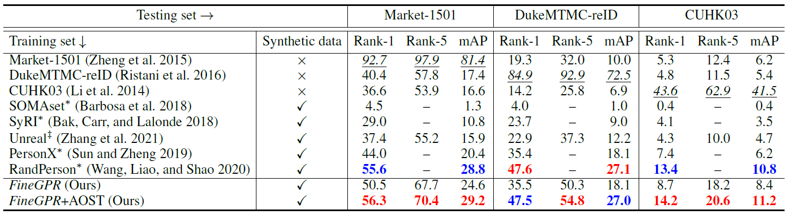
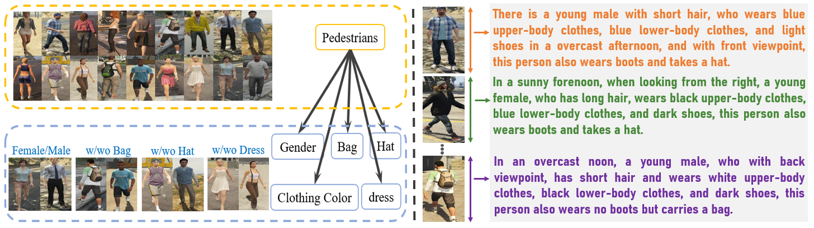

# Less is More: Learning from Synthetic Data with Fine-grained Attributes for Person Re-Identification
### [Suncheng Xiang](https://JeremyXSC.github.io/)
### [Shanghai Jiao Tong University](https://en.sjtu.edu.cn/)

## Overview
In this paper, we construct and label a large-scale synthetic person dataset named FineGPR with fine-grained attribute distribution. Moreover, aiming to
fully exploit the potential of FineGPR and promote the efficient training from millions of synthetic data, we propose an attribute analysis pipeline AOST to learn attribute distribution in target domain, then apply style transfer network to eliminate the gap between synthetic and real-world data and thus is freely deployed to new scenarios. Experiments conducted on benchmarks demonstrate that FineGPR with AOST outperforms (or is on par with) existing real and synthetic datasets, which suggests its feasibility for re-ID and proves the proverbial less-is-more principle. We hope this fine-grained dataset could advance research towards re-ID in real scenarios.
****


[**Video Sample**](https://www.youtube.com/watch?v=toR_73U9yLs)  :arrow_forward:

</div> 

****
## :fire: NEWS :fire:
- [10/2021] **📣The first FineGPR-Caption dataset is coming !**
- [09/2021] **📣The fine-grained caption dataset FineGPR is released !** Please note that this fine-grained FineGPR dataset can be only used for research purpose.

****
## Table of Contents👀
- [FineGPR Introduction](#FineGPR-Introduction)
- [Comparison with existing datasets](#Comparision-with-existing-datasets)
- [Link of the Dataset](#Link-of-the-Dataset)
- [Method](#Method)
- [Results](#Results)
- [Extendibility](#Extendibility)
- [FineGPR-Caption dataset](#FineGPR-Caption-dataset)
- [Citation](#Citation)
- [Ethical Considerations](#Ethical-Considerations)
- [LICENSE](#LICENSE)
- [Acknowledgements](#Acknowledgements)


****
## FineGPR Introduction
The FineGPR dataset is generated by a popular GTA5 game engine that can synthesise images under controllable viewpoints, weathers,illuminations and backgrounds, as well as 13 fine-grained attributes at the identity level :+1:. <br>

Our FineGPR dataset provides fine-grained and accurately configurable annotations, including 36 different viewpoints,
7 different kinds of weathers, 7 different kinds of illuminations, and 9 different kinds of backgrounds.


### Viewpoint📷
Definition of different viewpoints. Viewpoints of one identity are sampled at an interval of 10°, e.g. 0°-80° denotes that a person has 9 different angles in total.


### Weather🌨 and Illumination🌟
The exemplars of different weather distribution (left) and illumination distribution (right) from the proposed FineGPR dataset.


### Attributes at the Identity Level⛹️‍♀️
The distributions of attributes at the identity level on FineGPR. The left figure shows the numbers of IDs for each attribute. The middle and right pies illustrate the distribution of the colors of upper-body and low-body clothes respectively.


Some visual exemplars with ID-level pedestrian attributes in the proposed FineGPR dataset, such as Wear short sleeve , Wear dress, Wear hat, Carry bag, etc.


</div> 


****
## Comparison with existing datasets 
### Some Mainstream Datasets for Person Re-Identification
For FineGPR (for details of the pervious related work, please refer to the our [GPR Homepage](https://JeremyXSC.github.io/GPR/)) :

<center>

| dataset      | IDs (ID-Attributes)    | boxs | cams | weathers | illumination | scene | resolution |
|----------|:-:|:-:|:-:|:-:|:-:|:-:|:-:|
| [Market-1501](https://ieeexplore.ieee.org/stamp/stamp.jsp?tp=&arnumber=7410490) | 1,501 (✔️) |   32,668   |   6   |   -   |   -   |   -   |  low  |
| [CUHK03](https://ieeexplore.ieee.org/stamp/stamp.jsp?tp=&arnumber=6909421) | 1,467 (❌) |   14,096   |   2   |   -   |   -   |   -   |  low  |
| [DukeMTMC-reID](https://arxiv.org/pdf/1701.07717.pdf) | 1,404 (✔️) |   36,411   |   8   |   -   |   -   |   -   |  low   |
| [MSMT17](https://openaccess.thecvf.com/content_cvpr_2018/papers/Wei_Person_Transfer_GAN_CVPR_2018_paper.pdf) | 4,101 (❌) |   126,441   |   15   |   -   |   -   |   -   |  vary  |
| [SOMAset](https://arxiv.org/pdf/1701.03153.pdf) | 50 (❌) |   100,000   |   250   |   -   |   -   |   -   |  -  |
| [SyRI](https://arxiv.org/pdf/1804.10094.pdf) | 100 (❌) |   1,680,000   |   100   |   -   |   140   |   -   |  -  |
| [PersonX](https://arxiv.org/pdf/1812.02162.pdf) | 1,266 (❌) |   273,456   |   6   |   -   |   -   |   1   |  vary  |
| [Unreal](https://openaccess.thecvf.com/content/CVPR2021/papers/Zhang_UnrealPerson_An_Adaptive_Pipeline_Towards_Costless_Person_Re-Identification_CVPR_2021_paper.pdf) | 3,000 (❌) |   120,000   |   34   |   -   |   -   |   1   |  low  |
| [RandPerson](https://arxiv.org/abs/2006.12774) | 8,000 (❌) |   1,801,816   |   19   |   -   |   -   |   4   |  low  |
| [FineGPR](https://arxiv.org/pdf/2109.10498.pdf) |   1150 (✔️)   |   2,028,600   |   36   |   7   |   7   |   9   |  high  |
|</center>||||||||

****

## Link of the Dataset
### Data of FineGPR for Viewpoint Analysis
#### A small subset of FineGPR can be downloaded from the following links:<br>
* SJTU Yun Drive: 
	* [Download Link](https://jbox.sjtu.edu.cn/l/E1HTsw) password: qbdg
* Baidu Yun Drive: 
	* [Download Link](https://pan.baidu.com/s/1amLde8W1vpqacaqz8v4jWw) password: h4k5

* Microsoft OneDrive:
    * [Download Link](https://1drv.ms/u/s!AvX6fEo1OAv5sz448xpinu8k6rdU?e=kqmQ97)

#### Directories & Files of images
```shell
FineGPR_Dataset 
├── FineGPR/   # This file is our original dataset, we provide the samples of ID=0001 and ID=0003 in this file folder.
│   ├── 0001
│   │   ├── 0001_c01_w01_l01_p01.jpg 
│   │	├── 0001_c01_w01_l02_p01.jpg  
│   │   ├── 0001_c01_w01_l03_p01.jpg
│   │   └── ...
│   ├── 0003/
│   │   ├── 0003_c01_w01_l01_p06.jpg  
│   │   ├── 0003_c01_w01_l02_p06.jpg
│   │   ├── 0003_c01_w01_l03_p06.jpg	   
│   │   └── ...
│   └── ...
├── FineGPR_subset   # This file is the subset of FineGPR dataset, each Identity contains 4 images. 
│   ├── 0001_c01_w03_l05_p03.jpg 
│   ├── 0001_c10_w03_l05_p03.jpg
│   ├── 0001_c19_w03_l05_p03.jpg
│   ├── 0001_c28_w03_l05_p03.jpg
│   ├── 0003_c01_w03_l05_p08.jpg 
│   ├── 0003_c10_w03_l05_p08.jpg
│   ├── 0003_c19_w03_l05_p08.jpg
│   ├── 0003_c28_w03_l05_p08.jpg  
│   └── ...
└── README.md   # Readme file
```


#### Name of the image

Taking "0001_c01_w01_l01_p01.jpg" as an example: 
*  0001 is the id of the person
*  c01   is the id of the camera 
*  w01   is the id of the weather
*  l01   is the id of the illumination
*  p01   is the id of the background

#### Viewpoint annotations 
```shell
FineGPR
├── c01：90°      ├── c10：180°      ├── c19：270°      ├── c28：0°
├── c02：100°     ├── c11：190°      ├── c20：280°      ├── c29：10°
├── c03：110°     ├── c12：200°      ├── c21：290°      ├── c30：20°
├── c04：120°     ├── c13：210°      ├── c22：300°      ├── c31：30°
├── c05：130°     ├── c14：220°      ├── c23：310°      ├── c32：40°
├── c06：140°     ├── c15：230°      ├── c24：320°      ├── c33：50°
├── c07：150°     ├── c16：240°      ├── c25：330°      ├── c34：60°
├── c08：160°     ├── c17：250°      ├── c26：340°      ├── c35：70°
└── c09：170°     └── c18：260°      └── c27：350°      └── c36：80°
```

#### Weather annotations 
```shell
FineGPR
├── w01：Sunny
├── w02：Clouds    
├── w03：Overcast
├── w04：Foggy   
├── w05：Neutral
├── w06：Blizzard 
└── w07：Snowlight 	   
```

#### Illumination annotations
```shell
FineGPR
├── l01：Midnight
├── l02：Dawn    
├── l03：Forenoon
├── l04：Noon   
├── l05：Afternoon
├── l06：Dusk 
└── l07：Night 	   
```

#### Scene annotations
```shell
FineGPR
├── p01：Urban
├── p02：Urban   
├── p03：Wild
├── p04：Urban   
├── p05：Wild
├── p06：Urban
├── p07：Urban
├── p08：Wild 
└── p09：Urban 	   
```
****
## Method
💡The two-stage pipeline AOST to learn attribute distribution of target domain. Firstly, we learn attribute distribution of real domain on the basis of XGBoost & PSO learning system. Secondly, we perform style transfer to enhance the reality of optimal dataset. Finally, the transferred data are adopted for downstream re-ID task.


****
## Results
Performance comparison with existing Real and Synthetic datasets on Market-1501, DukeMTMC-reID and CUHK03, respectively. Our re-ID baseline system is built only with commonly used softmax cross-entropy loss on vanilla ResNet-50 with no bells and whistles.


### References

- [1] Image-image domain adaptation with preserved self-similarity and domain-dissimilarity for person re-identification. CVPR 2018.
- [2] Bag of tricks and a strong baseline for deep person re-identification. CVPRW 2019.

****

## Extendibility
Accompanied with our FineGPR, we also provide some human body masks (Middle) and keypoint locations (Bottom) of all characters during the annotation. We hope that our synthetic dataset FineGPR can not only contribute a lot to the development of generalizable person re-ID, but also advance the research of other computer vision tasks, such as human part segmentation and pose estimation. 


</div> 

## FineGPR-Caption dataset
On the basis of FineGPR, we introduce a dynamic strategy to generate high-quality captions with fine-grained attribute annotations for semantic-based
pretraining. To be more specific, we rearrange the different attributes as word embeddings into caption formula in the different position, and then generate semantically dense caption with high-quality description, which gives rise to our newlyconstructed FineGPR-Caption dataset.


</div> 

## Citation
If you use our FineGPR dataset for your research, please cite our [Paper](https://arxiv.org/pdf/2109.10498.pdf).
```
@article{xiang2021less,
  title={Less is More: Learning from Synthetic Data with Fine-grained Attributes for Person Re-Identification},
  author={Xiang, Suncheng and You, Guanjie and Guan, Mengyuan and Chen, Hao and Wang, Feng and Liu, Ting and Fu, Yuzhuo},
  journal={arXiv preprint arXiv:2109.10498},
  year={2021}
}
```
****

## Ethical Considerations
Our task and dataset were created with careful attention to ethical questions, which we encountered throughout our work. Access to our dataset will be provided for research purposes only and with restrictions on redistribution. Additionally, as we filtered out the sensitive attribute name in our fine-grained attribute annotation, our dataset cannot be easily repurposed for unintended tasks. Importantly, we are very cautious of human-annotation procedure of large scale datasets towards the social and ethical implications. Furthermore, we do not consider the datasets for developing non-research systems without further processing or augmentation. We hope this fine-grained dataset will shed light into potential tasks for the research community to move forward.

****

## LICENSE
- The FineGPR Dataset and FineGPR-Caption (FineGPR-C) is made available for non-commercial purposes only.
- You will not, directly or indirectly, reproduce, use, or convey the FineGPR or FineGPR-Caption Dataset or any Content, or any work product or data derived therefrom, for commercial purposes.

Permissions of this strong copyleft license (GNU General Public License v3.0) are conditioned on making available complete source code of licensed works and modifications, which include larger works using a licensed work, under the same license. Copyright and license notices must be preserved. Contributors provide an express grant of patent rights.

****

## Acknowledgements
We would like to thank authors of FineGPR, and FineGPR-Caption dataset for their work. They provide tremendous efforts in these dataset to advance the research in this field. We also appreciate [Yuze Fang](https://github.com/yuzefang96), [Mingye Xie](https://github.com/MyronXie), [Guanjie You](https://github.com/YGJsGitHub) for insightful feedback and discussion.

****

For further questions and suggestions about our datasets and methods, please feel free to contact Suncheng Xiang:
xiangsuncheng17@sjtu.edu.cn

